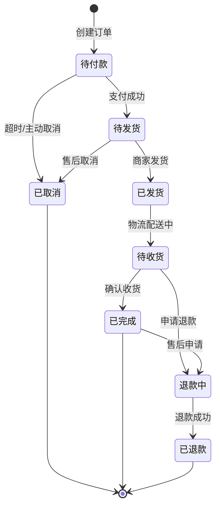
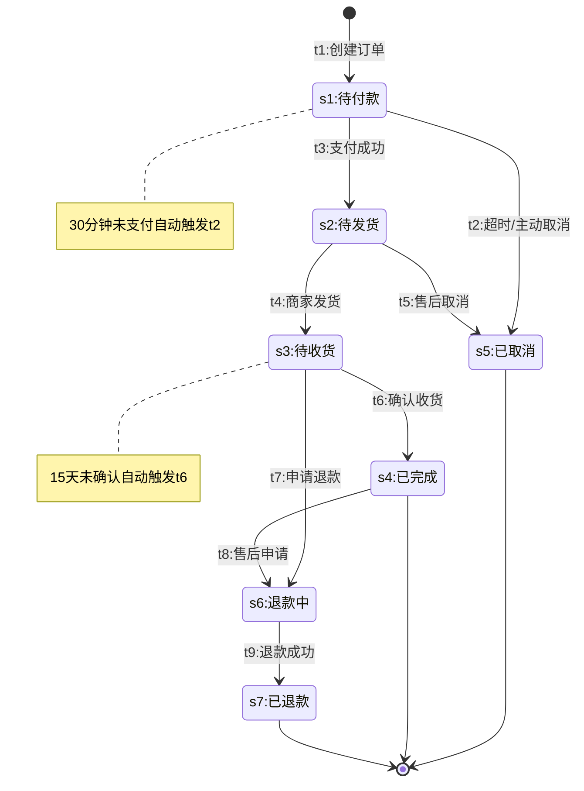

# test1
# 电商订单状态流转图

```mermaid
stateDiagram-v2
    [*] --> 待付款: 创建订单
    待付款 --> 已取消: 超时/主动取消
    待付款 --> 待发货: 支付成功
    
    待发货 --> 已发货: 商家发货
    待发货 --> 已取消: 售后取消
    
    已发货 --> 待收货: 物流配送中
    待收货 --> 已完成: 确认收货
    待收货 --> 退款中: 申请退款
    
    已完成 --> 退款中: 售后申请
    退款中 --> 已退款: 退款成功
    
    已取消 --> [*]
    已完成 --> [*]
    已退款 --> [*]
```
# 电商订单状态流转图

```mermaid
stateDiagram-v2
    %% 定义所有状态 (s 开头)
    state "s1:待付款" as s1
    state "s2:待发货" as s2
    state "s3:待收货" as s3
    state "s4:已完成" as s4
    state "s5:已取消" as s5
    state "s6:退款中" as s6
    state "s7:已退款" as s7

    %% 定义所有转换 (t 开头)
    [*] --> s1: t1:创建订单
    s1 --> s5: t2:超时/主动取消
    s1 --> s2: t3:支付成功
    
    s2 --> s3: t4:商家发货
    s2 --> s5: t5:售后取消
    
    s3 --> s4: t6:确认收货
    s3 --> s6: t7:申请退款
    
    s4 --> s6: t8:售后申请
    s6 --> s7: t9:退款成功
    
    s5 --> [*]
    s4 --> [*]
    s7 --> [*]

    %% 添加注释
    note right of s1: 30分钟未支付自动触发t2
    note right of s3: 15天未确认自动触发t6
```
