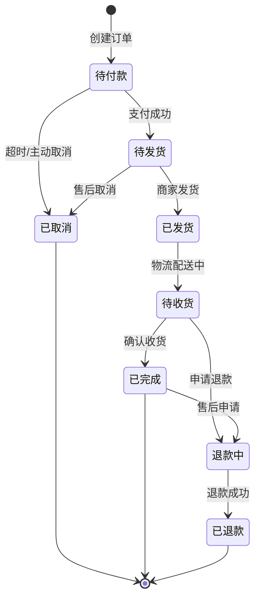
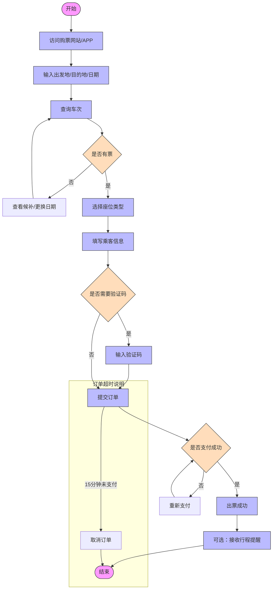

# test1
# 电商订单状态流转图

```mermaid
stateDiagram-v2
    [*] --> 待付款: 创建订单
    待付款 --> 已取消: 超时/主动取消
    待付款 --> 待发货: 支付成功
    
    待发货 --> 已发货: 商家发货
    待发货 --> 已取消: 售后取消
    
    已发货 --> 待收货: 物流配送中
    待收货 --> 已完成: 确认收货
    待收货 --> 退款中: 申请退款
    
    已完成 --> 退款中: 售后申请
    退款中 --> 已退款: 退款成功
    
    已取消 --> [*]
    已完成 --> [*]
    已退款 --> [*]
```

```mermaid
flowchart TD
    开始([开始]) --> A[访问购票网站/APP]
    A --> B[输入出发地/目的地/日期]
    B --> C[查询车次]
    C --> D{是否有票}
    
    D -->|否| E[查看候补/更换日期]
    E --> C
    
    D -->|是| F[选择座位类型]
    F --> G[填写乘客信息]
    G --> H{是否需要验证码}
    
    H -->|是| I[输入验证码]
    I --> J[提交订单]
    
    H -->|否| J
    
    J --> K{是否支付成功}
    K -->|否| L[重新支付]
    L --> K
    
    K -->|是| M[出票成功]
    M --> N[可选：接收行程提醒]
    N --> 结束([结束])

    %% 添加说明
    subgraph 订单超时说明
        J --> |15分钟未支付|取消订单
        取消订单 --> 结束
    end

    %% 样式定义
    classDef start fill:#f9f,stroke:#333
    classDef process fill:#bbf,stroke:#333
    classDef decision fill:#fdb,stroke:#333
    
    %% 应用样式
    class 开始,结束 start
    class A,B,C,F,G,I,J,M,N process
    class D,H,K decision
```
