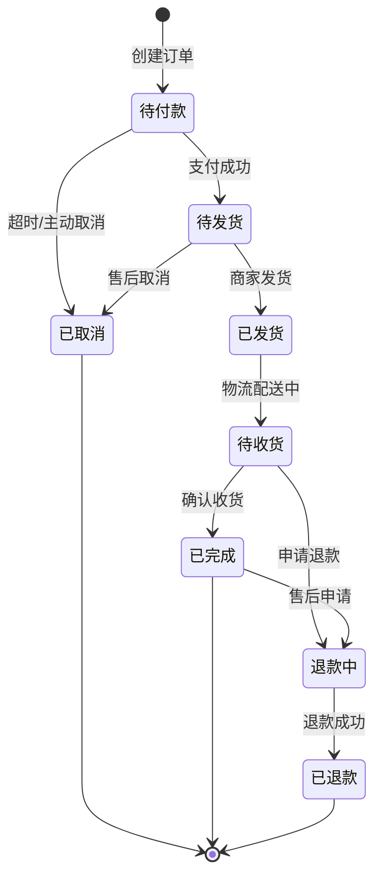

# test1
# 电商订单状态流转图

```mermaid
stateDiagram-v2
    [*] --> 待付款: 创建订单
    待付款 --> 已取消: 超时/主动取消
    待付款 --> 待发货: 支付成功
    
    待发货 --> 已发货: 商家发货
    待发货 --> 已取消: 售后取消
    
    已发货 --> 待收货: 物流配送中
    待收货 --> 已完成: 确认收货
    待收货 --> 退款中: 申请退款
    
    已完成 --> 退款中: 售后申请
    退款中 --> 已退款: 退款成功
    
    已取消 --> [*]
    已完成 --> [*]
    已退款 --> [*]
```
