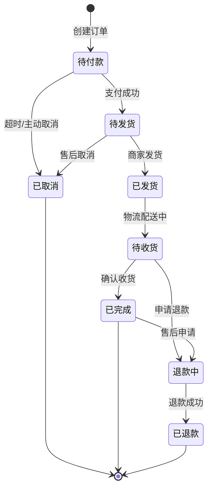

# test1
# 电商订单状态流转图

@startuml
|用户|
start
:登录购票网站;
:输入出发地/目的地/日期;
:查询车次;

|系统|
:显示符合条件的车次信息;

|用户|
:选择车次;
:选择座位类型;

|系统|
:检查座位余票;

if (是否有票?) then (有)
  |用户|
  :填写乘客信息;
  :选择支付方式;
  
  |系统|
  :生成订单;
  
  |用户|
  :支付订单;
  
  |系统|
  if (支付是否成功?) then (成功)
    :出票;
    :发送订票成功通知;
  else (失败)
    :显示支付失败;
    :返回支付页面;
  endif
  
else (无)
  |系统|
  :提示无票;
  :建议更换车次或日期;
endif

|用户|
stop
@enduml
