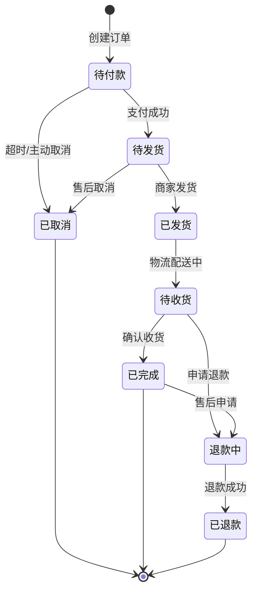

# test1
# 电商订单状态流转图


```mermaid
stateDiagram-v2
    %% 这是注释语法
    
    %% 定义状态样式
    classDef default fill:#f9f9f9,stroke:#333,stroke-width:2px
    classDef active fill:#d4edda,stroke:#28a745,stroke-width:2px
    classDef error fill:#f8d7da,stroke:#dc3545,stroke-width:2px
    
    [*] --> 待付款: 创建订单
    待付款 --> 已取消: 超时/主动取消
    待付款 --> 待发货: 支付成功
    
    %% 使用note添加说明
    note right of 待付款: 订单创建后30分钟内未支付自动取消
    
    待发货 --> 已发货: 商家发货
    待发货 --> 已取消: 售后取消
    
    已发货 --> 待收货: 物流配送中
    待收货 --> 已完成: 确认收货
    待收货 --> 退款中: 申请退款
    
    已完成 --> 退款中: 售后申请
    退款中 --> 已退款: 退款成功
    
    已取消 --> [*]
    已完成 --> [*]
    已退款 --> [*]
    
    %% 应用样式
    class 待付款,待发货,待收货 active
    class 已取消,退款中 error
```
